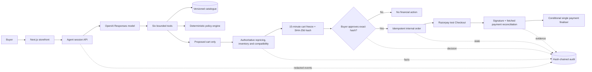

# Architecture

## Trust boundary



The model and catalogue text are probabilistic or untrusted. Everything that changes cart, order,
or payment state is deterministic and server-side. The model receives no order, approval, checkout,
capture, reconciliation, or notification-delivery tool.

## Components

| Component | Responsibility | Authority |
|---|---|---|
| Next.js storefront | Product discovery, agent activity, exact approval, test Checkout UI | Presents choices only |
| Agent service | Maximum-eight-step Responses loop, six strict tools, budgets, degraded mode | Search/read/propose/escalate |
| Catalogue contracts | 500 products, integer-paise prices, availability, compatibility, ETag | Read-only merchant facts |
| Policy engine | Ordered allow/deny/escalate rules with stable IDs | Deterministic decision |
| Commerce service | Reprice, validate, canonicalize, freeze, hash, approve, create order | Financial state machine |
| Razorpay service | One test order, signatures, fetched truth, webhooks, dedupe | Payment evidence ingestion |
| Payment finaliser | Conditional paid-state transition | Sole payment-state writer |
| Audit service | Redaction, sequence, SHA-256 hash chain, verification endpoint | Reproducible evidence |
| WhatsApp handoff | Opt-in, signed review link, local utility-message outbox | No external transmission |

## State flows

Cart states:

```text
proposed -> frozen -> approved -> ordered
              |          |
              +-> expired/invalidated
```

Order states:

```text
payment_pending -> paid
```

Rejected or failed payment evidence is recorded but cannot move a paid order backwards. Provider
event IDs, internal order idempotency keys, and the one-checkout-per-order constraint make retries
converge.

## Data and interfaces

- SQLite is the zero-configuration local database; `DATABASE_URL` can target a production database.
- All money is integer paise in storage, schemas, tools, hashes, and verification.
- Machine contracts live at `/.well-known/agent-catalog.json` and
  `/.well-known/agent-policy.json`.
- Public audit verification is `GET /api/audit/{agent_session|cart|order}/{id}`.
- The signed WhatsApp review route discloses the frozen cart only and explicitly permits no
  financial approval.

## Failure behavior

- Missing or failed LLM: labelled deterministic catalogue search; no cart is fabricated.
- Invalid tool output: one repair, then stop.
- Changed/expired cart: invalidate and require a new freeze and approval.
- Razorpay outage or mismatch: no payment state is assumed.
- Duplicate callback/webhook: return the existing result.
- WhatsApp disabled: keep the complete in-app path available.
- Audit tampering: verification returns `valid: false`.

